## Advanced Lane Finding Project

The goals / steps of this project are the following:

* Compute the camera calibration matrix and distortion coefficients given a set of chessboard images.
* Apply a distortion correction to raw images.
* Use color transforms, gradients, etc., to create a thresholded binary image.
* Apply a perspective transform to rectify binary image ("birds-eye view").
* Detect lane pixels and fit to find the lane boundary.
* Determine the curvature of the lane and vehicle position with respect to center.
* Warp the detected lane boundaries back onto the original image.
* Output visual display of the lane boundaries and numerical estimation of lane curvature and vehicle position.


### Camera Calibration

The example of camera calibration code is in 'runCamCalibration.py'. 

Just run:

`python runCamCalibration.py`

I start by preparing "object points", which will be the (x, y, z) coordinates of the chessboard corners in the world. Here I am assuming the chessboard is fixed on the (x, y) plane at z=0, such that the object points are the same for each calibration image.  Thus, `objp` is just a replicated array of coordinates, and `objpoints` will be appended with a copy of it every time I successfully detect all chessboard corners in a test image.  `imgpoints` will be appended with the (x, y) pixel position of each of the corners in the image plane with each successful chessboard detection.  

I save the objpoints and imgpoints data in  'wide_dist_pickle.p', which can be used to camera calibration and distortion correction.I applied this distortion correction to the test image using the `cv2.undistort()` function and obtained this result: 

```
import numpy as np
import cv2
import glob
import matplotlib.pyplot as plt
import pickle
from AdvLaneDet  import CameraCalibration as CamCalib

camera_calibraion_dir = 'camera_cal'
n_corner_x = 9
n_corner_y = 6
#get chessboard coordinates of objects and images for calibration 
objpoints,imgpoints = CamCalib.get_CameraCalib_Coord(camera_calibraion_dir,n_corner_x,n_corner_y,draw=True)
#dump to pickle file
dist_pickle = {}
dist_pickle["objpoints"] = objpoints
dist_pickle["imgpoints"] = imgpoints
with open('wide_dist_pickle.p', 'wb') as f:
    pickle.dump(dist_pickle, f)   
del objpoints, imgpoints
#load obj/image points
dist_pickle = pickle.load( open( "wide_dist_pickle.p", "rb" ) )
objpoints = dist_pickle["objpoints"]
imgpoints = dist_pickle["imgpoints"]
# distortion correction by mapping objects and images coordinates
image_path = camera_calibraion_dir + '/calibration1.jpg'
img = cv2.imread(image_path)
gray = cv2.cvtColor(img,cv2.COLOR_BGR2GRAY)


undist = CamCalib.calUndistort(gray, objpoints, imgpoints)
print('Dirstortion correction:')
fig = plt.figure(figsize= (6*2,3*1))
plt.subplot(121)
plt.imshow(gray,'gray')
plt.title('distorted image')
plt.axis('off')
plt.subplot(122)
plt.imshow(undist,'gray')
plt.title('undistorted image')
plt.axis('off')
plt.show()
```

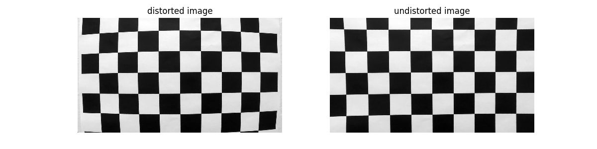


### Pipeline (single images)

#### 1. example of a distortion-corrected image.

To demonstrate this step, I will describe how I apply the distortion correction to one of the test images like this one:

you can find that code in Advanced_Lane_Detection.ipynb distortion correction cell

```
import glob
import numpy as np
#extract frame from video
images = glob.glob('test_images/*.jpg')
fname = images[2]
frame = plt.imread(fname)
undist = CamCalib.calUndistort(frame, objpoints, imgpoints)
fig = plt.figure(figsize= (6*2,3*1))
plt.subplot(121)
plt.imshow(frame)
plt.title('origin frame')
plt.axis('off')
plt.subplot(122)
plt.imshow(undist)
plt.title('undistorted frame')
plt.axis('off')
plt.show()
```

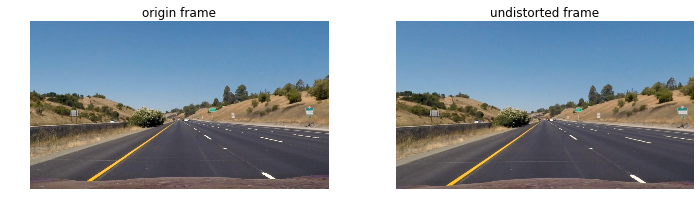


#### 2. Binary Image:

####  color transforms, gradients or other methods to create a thresholded binary image.  

I used a combination of s-channle of hsv,  gradient thresholds, and direction of  gradient to generate a binary image. After threshold images, I applied ROI area on it.

The pipeline of binary image are:

1. distortion correction
2. Magnitude and gradient direction threshold
3. red channel gradient threshold
4. saturated channel gradient threshold
5. ROI mask

 (thresholding steps at lines #103 through #139 in `AdvLaneDet/Threshold.py`).  Here's an example of my output for this step. Or, you can run runThreshold.py to process images in 'test_images' directory .

```
#load obj/image points
dist_pickle = pickle.load( open( "wide_dist_pickle.p", "rb" ) )
objpoints = dist_pickle["objpoints"]
imgpoints = dist_pickle["imgpoints"]
#set ROI
height =720
width =1280
shirk_roi_upper_edge = np.round(width *0.48)
roi_upper = np.round(0.6*height)
roi_lower = np.round(height*0.93)
roi_upper_left = (shirk_roi_upper_edge,roi_upper)
roi_upper_right = (width-shirk_roi_upper_edge, roi_upper)
roi_down_left = (np.round(width*0.1), roi_lower)
roi_down_right = (np.round(width-(width*0.1)),roi_lower)
# mask ROI insize triangle
triangle_lower_left = (np.round(width*0.28),roi_lower)
triangle_lower_right = (np.round(width-(width*0.28)),roi_lower)
triangle_top = (np.round(width*0.5),np.round(0.65*height))
#  verices of ROI
ROI_vertices = np.array([[roi_upper_left,roi_down_left,triangle_lower_left,triangle_top,triangle_lower_right,roi_down_right,roi_upper_right]], dtype=np.int32)
#set threshold 
ksize = 15 
grad_thrshold = (40,100)
s_threhold = (170,255)
mag_thresh = (130,255)

images = glob.glob('test_images/*.jpg')
fname = images[1]
image = plt.imread(fname)
#distortion correction
undist = CamCalib.calUndistort(image, objpoints, imgpoints)
binary = Threshold.pipeline(undist, objpoints, imgpoints, ROI_vertices,ksize=ksize, grad_thresh=grad_thrshold, s_thresh=s_threhold,mag_thresh=mag_thresh, debug=True)
```

| 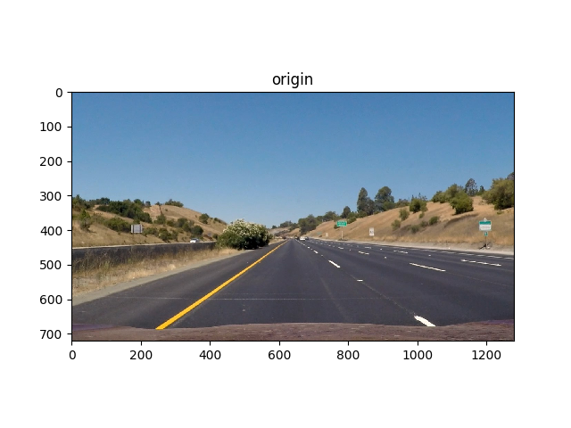 | 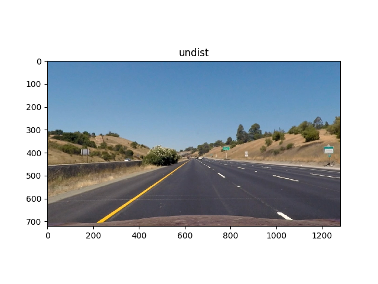 |
| :------------------------------: | -------------------------------- |
| 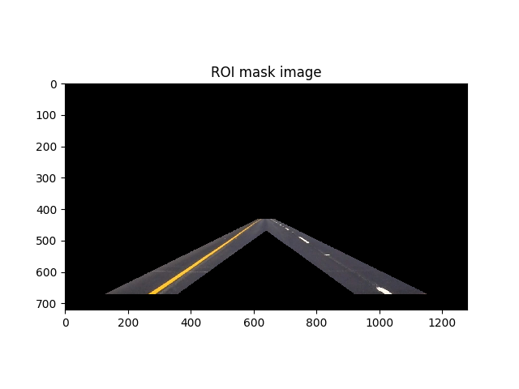 | 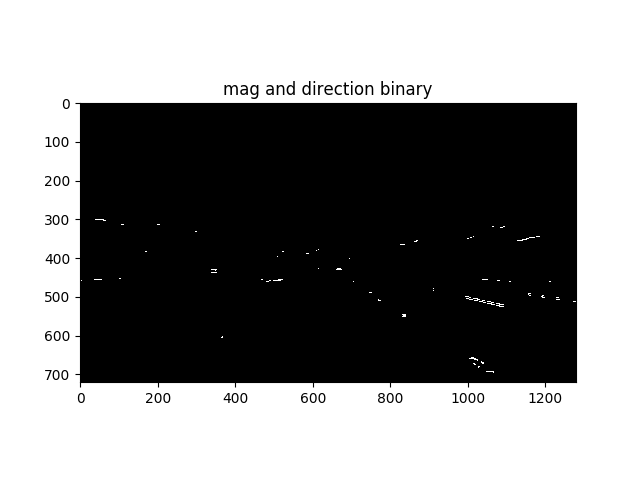 |
| 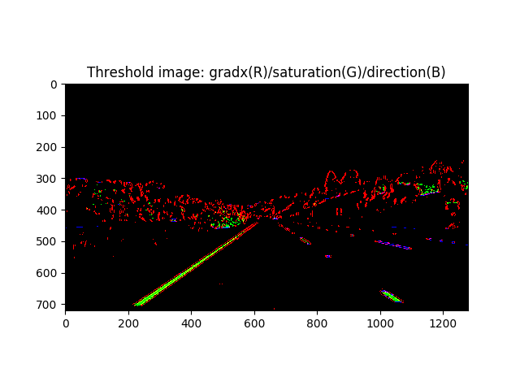 | 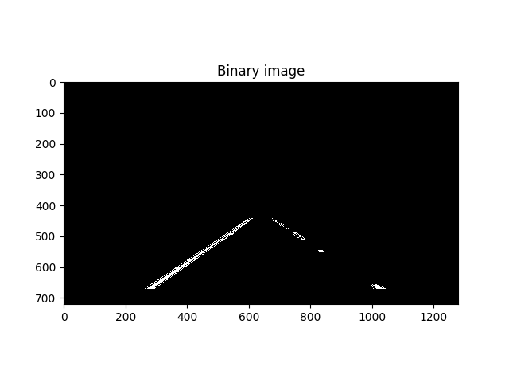 |


#### 3.  Perspective transform

The code for my perspective transform in a function LaneDetection_pipline() in LaneDetection.py, which appeares in line #340 to #359. You can alslo find in Lane Detection cell of the jupyter notebook.  

Here, I hard coeded source (`src`) and destination (`dst`) points by ROI of the  test video.This resulted in the following source and destination points:

```
if (LD.M is None) or (LD.Minv is None):
    #src and dist coordinate for perception transformation
    src = np.float32([[ 585,  460],
                      [ 203,  684],
                      [1126,  684],
                      [ 695,  460]])
    dst = np.float32([[ 213,    0],
                      [ 213,  720],
                      [1066,  720],
                      [1066,    0]])
    LD.M = cv2.getPerspectiveTransform(src, dst)
    LD.Minv = cv2.getPerspectiveTransform(dst, src)
if (LD.ym_per_pix is None) or (LD.xm_per_pix is None):
    # Define conversions in x and y from pixels space to meters
    LD.ym_per_pix = 30/720 # meters per pixel in y dimension
    LD.xm_per_pix = 3.7/700 # meters per pixel in x dimension

undist = CamCalib.calUndistort(image, LD.objpoints, LD.imgpoints)
binary = Threshold.pipeline(undist, LD.objpoints, LD.imgpoints, LD.ROI_vertices,ksize=LD.ksize, grad_thresh=LD.grad_thrshold, s_thresh=LD.s_threhold,mag_thresh=LD.mag_thresh, debug=False)
binary_warped = cv2.warpPerspective(binary, LD.M, LD.img_size, flags=cv2.INTER_NEAREST)

```

I verified that my perspective transform was working as expected by drawing the `src` and `dst` points onto a test image and its warped counterpart to verify that the lines appear parallel in the warped image.

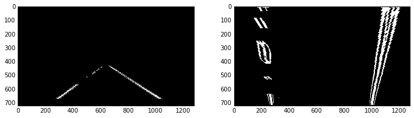

#### 4.Lane-line pixels and fit positions with a polynomial

There are two method to fit position with a polynomial:

1. fit from scratch
2. fit from previous lane's polynomial

The fit polynomial function is in the class method getNextLanePoly() and getLanePloy(), whichi are in LaneDetection.py  from line #45 to #202

The rules to choose which method used to fit is in LaneDetection.py from line #361 to #368.

The first and second frames would fit polynomial from scratch. Then the frames would  fit from previous lane's polynomial. While the number of detected points less than half previous points or lane or the position far away from center of lane too much, the frame would fit from scratch. 

```
 if (LD.n_prev_detected_pts_left is None) or (LD.n_prev_detected_pts_right is None):
        LD.getLanePloy(binary_warped,visualize=visualize)
    elif  (LD.n_detected_pts_left < LD.n_prev_detected_pts_left/2) or (LD.n_detected_pts_right < LD.n_prev_detected_pts_right/2):
        LD.getLanePloy(binary_warped,visualize=visualize)
    elif LD.line_base_pos > LD.max_bais_center:
        LD.getLanePloy(binary_warped,visualize=visualize)
    else:
        LD.getNextLanePoly(binary_warped,LD.left_fit,LD.right_fit,visualize=visualize)
```

Then I did some other stuff and fit my lane lines with a 2nd order polynomial kinda like this:

1. Fit from scratch:

   the green windows are search windows searches lane points from bottom to top, and then fit the polynomial of those points.

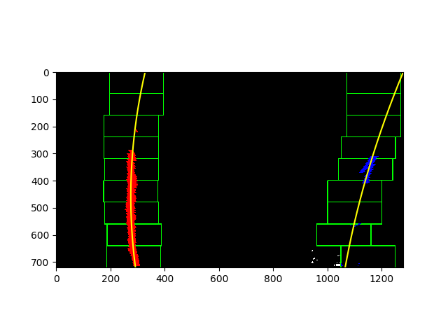

2. Fit by previous lane's polynomial :

   the green areas is the search area increased width from previous lane's polynomial.

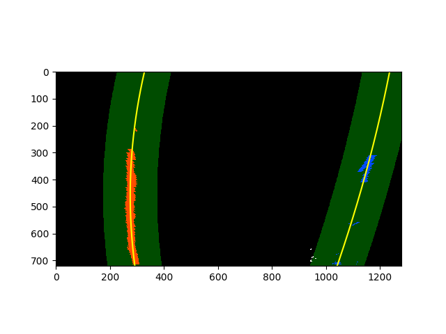

#### 5. The radius of curvature of the lane and the position of the vehicle with respect to center.

The curvature are calculated from the points coordinate in images to actual scale in meters. 

The equation to calculate lane's curvature is:

### Radius of Curvature

The radius of curvature at any point x of the function x=f(y) is given as follows:


$Rcurve=\frac{(1+\frac{dx}{dy}^2)^\frac{3}{2}}{|\frac{d^2x}{dy^2}|}$

so, for the function$ f(y)=Ay^2+By+C $

$Rcurve=\frac{(1+(2A+B)^2)\frac{3}{2}}{|2A|}$

I did this in class method calCurvature in LaneDetection.py from  lines #236 through #247 

```
def calCurvature(self,left_fit,right_fit,img_size,xm_per_pix,ym_per_pix):
        
        y_eval = img_size[1]
        ploty = np.linspace(0, img_size[1]-1, img_size[1])
        left_fitx = left_fit[0]*ploty**2 + left_fit[1]*ploty + left_fit[2]
        right_fitx = right_fit[0]*ploty**2 + right_fit[1]*ploty + right_fit[2]
        # Fit new polynomials to x,y in world space
        left_fit_cr = np.polyfit(ploty*ym_per_pix, left_fitx*xm_per_pix, 2)
        right_fit_cr = np.polyfit(ploty*ym_per_pix, right_fitx*xm_per_pix, 2)
        # Calculate the new radii of curvature
        left_curverad = ((1 + (2*left_fit_cr[0]*y_eval*ym_per_pix + left_fit_cr[1])**2)**1.5) / np.absolute(2*left_fit_cr[0])
        right_curverad = ((1 + (2*right_fit_cr[0]*y_eval*ym_per_pix + right_fit_cr[1])**2)**1.5) / np.absolute(2*right_fit_cr[0])
        self.left_curvature = left_curverad
        self.right_curvature= right_curverad
```


#### 6. Lane detected in frames

I implemented this step in LaneDetection_pipline() in lines #288 through #381 in `LaneDetection.py`. 

```
def LaneDetection_pipline(image,LD,vid=1,visualize=False):
    
    if LD.img_size is None:
        LD.img_size = (image.shape[1],image.shape[0])
    
    if (LD.CamCalib_objpoints is None) or (LD.CamCalib_imgpoints is None):
        #load obj/image points
        dist_pickle = pickle.load( open( "wide_dist_pickle.p", "rb" ) )
        LD.objpoints = dist_pickle["objpoints"]
        LD.imgpoints = dist_pickle["imgpoints"]
    
    if (LD.ksize is None) or (LD.grad_thrshold is None) or (LD.s_threhold is None) or (LD.mag_thresh is None):
        LD.ksize = 15 # Choose a larger odd number to smooth gradient measurements
        LD.grad_thrshold = (40,100)
        LD.s_threhold = (170,255)
        LD.mag_thresh = (130,255)

    if LD.ROI_vertices is None:
   
        #set ROI
        if vid  == 1:
            height = LD.img_size[1]
            width = LD.img_size[0]
            shirk_roi_upper_edge = np.round(width *0.48)
            roi_upper = np.round(0.6*height)
            roi_lower = np.round(height*0.93)
            roi_upper_left = (shirk_roi_upper_edge,roi_upper)
            roi_upper_right = (width-shirk_roi_upper_edge, roi_upper)
            roi_down_left = (np.round(width*0.1), roi_lower)
            roi_down_right = (np.round(width-(width*0.1)),roi_lower)
            # mask ROI insize triangle
            triangle_lower_left = (np.round(width*0.28),roi_lower)
            triangle_lower_right = (np.round(width-(width*0.28)),roi_lower)
            triangle_top = (np.round(width*0.5),np.round(0.65*height))
            #  verices of ROI
            LD.ROI_vertices = np.array([[roi_upper_left,roi_down_left,triangle_lower_left,triangle_top,triangle_lower_right,roi_down_right,roi_upper_right]], dtype=np.int32)
    
        if vid == 2:
            height = LD.img_size[1]
            width = LD.img_size[0]
            shirk_roi_upper_edge = np.round(width *0.42)
            roi_upper = np.round(0.68*height)
            roi_lower = np.round(height*0.96)
            roi_upper_left = (shirk_roi_upper_edge,roi_upper)
            roi_upper_right = (width-shirk_roi_upper_edge, roi_upper)
            roi_down_left = (np.round(width*0.16), roi_lower)
            roi_down_right = (np.round(width-(width*0.08)),roi_lower)
            # mask ROI insize triangle
            triangle_lower_left = (np.round(width*0.28),roi_lower)
            triangle_lower_right = (np.round(width-(width*0.26)),roi_lower)
            triangle_top = (np.round(width*0.5),np.round(0.70*height))
            LD.ROI_vertices = np.array([[roi_upper_left,roi_down_left,triangle_lower_left,triangle_top,triangle_lower_right,roi_down_right,roi_upper_right]], dtype=np.int32)
    if (LD.M is None) or (LD.Minv is None):
        #src and dist coordinate for perception transformation
        src = np.float32([[ 585,  460],
                          [ 203,  684],
                          [1126,  684],
                          [ 695,  460]])
        dst = np.float32([[ 213,    0],
                          [ 213,  720],
                          [1066,  720],
                          [1066,    0]])
        LD.M = cv2.getPerspectiveTransform(src, dst)
        LD.Minv = cv2.getPerspectiveTransform(dst, src)
    if (LD.ym_per_pix is None) or (LD.xm_per_pix is None):
        # Define conversions in x and y from pixels space to meters
        LD.ym_per_pix = 30/720 # meters per pixel in y dimension
        LD.xm_per_pix = 3.7/700 # meters per pixel in x dimension

    undist = CamCalib.calUndistort(image, LD.objpoints, LD.imgpoints)
    binary = Threshold.pipeline(undist, LD.objpoints, LD.imgpoints, LD.ROI_vertices,ksize=LD.ksize, grad_thresh=LD.grad_thrshold, s_thresh=LD.s_threhold,mag_thresh=LD.mag_thresh, debug=False)
    binary_warped = cv2.warpPerspective(binary, LD.M, LD.img_size, flags=cv2.INTER_NEAREST)
    
    if (LD.n_prev_detected_pts_left is None) or (LD.n_prev_detected_pts_right is None):
        LD.getLanePloy(binary_warped,visualize=visualize)
    elif  (LD.n_detected_pts_left < LD.n_prev_detected_pts_left/2) or (LD.n_detected_pts_right < LD.n_prev_detected_pts_right/2):
        LD.getLanePloy(binary_warped,visualize=visualize)
    elif LD.line_base_pos > LD.max_bais_center:
        LD.getLanePloy(binary_warped,visualize=visualize)
    else:
        LD.getNextLanePoly(binary_warped,LD.left_fit,LD.right_fit,visualize=visualize)
    
    LD.calCurvature(LD.left_fit,LD.right_fit,LD.img_size,LD.xm_per_pix,LD.ym_per_pix)
    colored_lane = LD.drawLaneRegion(binary_warped,undist,LD.Minv,LD.left_fit,LD.right_fit)
    position = LD.Postion_in_Lane(LD.left_fit,LD.right_fit,LD.img_size)
    LD.line_base_pos = (LD.img_size[0]/2 - position)*LD.xm_per_pix
    if LD.line_base_pos  > 0 :
        text = 'right'
    else:
        text = 'left'
    cv2.putText(colored_lane,'Radius of Curvature: %.2fm' % LD.left_curvature,(20,40), cv2.FONT_HERSHEY_SIMPLEX, 1,(255,255,255),2)
    cv2.putText(colored_lane,'Away Center: %.2fm %s' % (abs(LD.line_base_pos),text),(20,80), cv2.FONT_HERSHEY_SIMPLEX, 1,(255,255,255),2)

    return colored_lane
```

 Here is an example of my result on a test image:


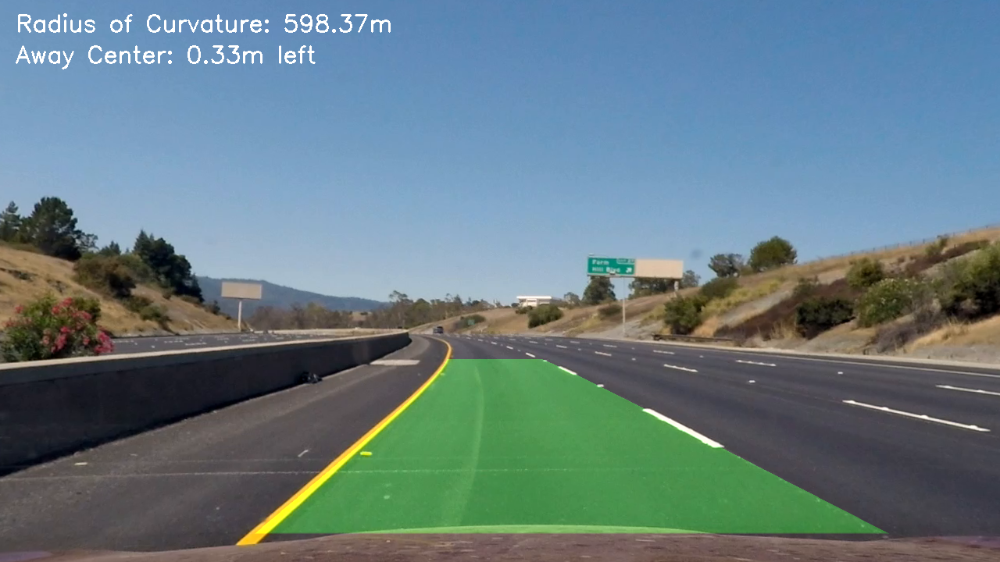

---

### Pipeline (video)

#### The process of video stream to detect lane is in runLaneDetection.py

Here's a [link to my video result](./project_video_output.mp4)

```
LD = LaneDetection.LaneDetection()
clip = VideoFileClip("project_video.mp4")#.subclip(10,13)
##test 0
out_clip = clip.fx(LaneDetection.LD_pipeline_VidProc, LD,vid=1,visualize=False)
out_clip.write_videofile('project_video_output.mp4', audio=False)    
```


---

### Discussion

In this project, I followed the processes from the 'Advanced Land Finding'  session. The pipeline to detect the lane is quite logical and reasonable. Except there are still a lot of parameters have to be tuned. For example, The ROI in videos are different, which might be adjusted from users from their camera setting in the beginning. Some parameters have to be adjusted carefully, such as binary image threshold, perspective matrix mapping points. The most important step is to recognize two side lines.  The lines could be variant in different high way or changed by shadow or weather condition.

To add more robust algorithm to detect lines would be helpful of lane detection!

